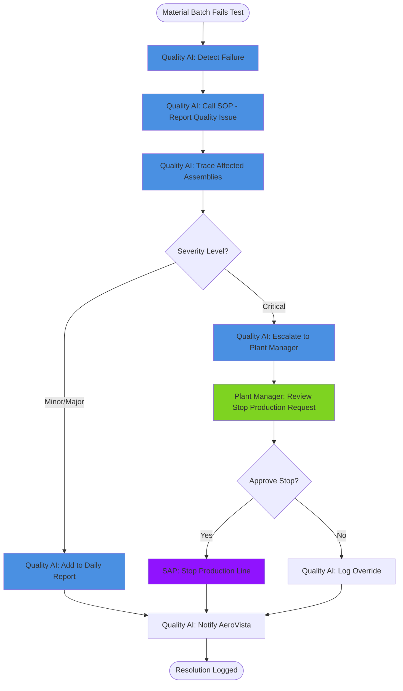

# BPMN AI Process Generator

This skill generates Business Process Model and Notation (BPMN 2.0) diagrams that show AI Personas as first-class process participants. AI Personas get their own swimlanes alongside human actors, with authority levels shown at decision gateways and human approval points explicitly marked.

This addresses the methodology Chapter 12 modeling requirement: showing how AI Personas fit into business processes as delegated actors, not invisible automation.

## When to Use

- After completing AI Persona definitions (Chapter 7)
- When demonstrating how personas interact across company boundaries
- During scenario choreography to visualize entity chains
- For stakeholder communication showing human-AI collaboration
- During Change Advisory Circle reviews to show cross-domain workflows
- When documenting data supply chain flows (Chapter 16)

## Key Concepts

### AI Personas as Process Participants

Traditional BPMN shows only human actors and system pools. This methodology extends BPMN to include:
- **AI Persona Swimlanes** — Autonomous AI actors with delegated authority
- **Authority Gateway Annotations** — Level 0/1/2/3 marked at decision points
- **Human Approval Tasks** — Explicit user tasks where AI escalates to human
- **Cross-Domain Message Flows** — Agent travel between company nodes

### Scenario Entity Chains as Process Input

The entity chains from scenario choreography become process flows:

```yaml
scenario: Quality Escape at SpinnyThings
entity_chain:
  - trigger: "Material batch fails tensile test"
  - agent_action: "Quality Inspection AI detects failure"
  - sop_call: "SOP-SPINY-QUAL-02.report_quality_issue"
  - authority_check: "Level 2 — bounded autonomous action"
  - agent_action: "Trace affected assemblies"
  - sop_call: "SOP-SPINY-INV-01.get_material_usage"
  - decision_gateway: "Severity > Critical?"
  - if_yes: "Escalate to Plant Manager (Level 1)"
  - if_no: "Batch for daily report (Level 2)"
```

This chain becomes a BPMN process with swimlanes, tasks, gateways, and message flows.

## Instructions

### 1. Identify Scenario Scope

Define what process you're modeling:

```yaml
process_definition:
  scenario_name: "Quality Escape Response"
  scenario_id: "SCEN-001"
  company_scope: ["AeroVista", "SpinnyThings"]
  duration_target: "< 48 hours from detection to resolution"
  trigger: "Material batch failure detected at SpinnyThings"
  outcome: "Affected assemblies identified, AeroVista notified, production stopped if needed"
```

### 2. Map Participants to Swimlanes

Identify all actors involved:

#### AI Persona Swimlanes
```yaml
ai_personas:
  - persona_id: "PERS-SPINY-QI-01"
    persona_name: "Quality Inspection AI"
    authority_level: "0-3 graduated"
    owning_company: "SpinnyThings"
    color: "#4A90E2"  # Blue for AI personas
```

#### Human Actor Swimlanes
```yaml
human_actors:
  - role: "Plant Manager"
    authority: "Approval for production stops"
    owning_company: "SpinnyThings"
    color: "#7ED321"  # Green for human actors
  - role: "Quality Director"
    authority: "Severity assessment, escalation routing"
    owning_company: "SpinnyThings"
    color: "#7ED321"
```

#### System Swimlanes
```yaml
systems:
  - system_name: "SAP S/4HANA"
    system_id: "SAP-SPINY"
    role: "ERP data source"
    company: "SpinnyThings"
    color: "#9013FE"  # Purple for systems
```

#### External Participant Pools
```yaml
external_pools:
  - pool_name: "AeroVista (Customer)"
    pool_type: "External Company"
    color: "#F5A623"  # Orange for external
```

### 3. Map Entity Chain to BPMN Elements

Convert scenario steps to BPMN constructs:

| Entity Chain Element | BPMN Element | Notation |
|---------------------|--------------|----------|
| Trigger event | Start Event | Circle |
| Agent action | Task | Rounded rectangle |
| SOP call | Service Task | Rounded rectangle with gear icon |
| Authority check | Data-Based Gateway | Diamond with X |
| Human decision | User Task | Rounded rectangle with person icon |
| Escalation | Message Intermediate Event | Circle with envelope |
| Outcome | End Event | Bold circle |

### 4. Generate Process Flow

#### Example: Quality Escape Process (Mermaid Syntax)



#### Authority Level Annotations

Add authority level markers at gateways:

```mermaid
    CheckSeverity{Severity Level?}

    note right of CheckSeverity
        Authority Level 2
        (Bounded Autonomous)

        Decision Rules:
        - Critical → Level 1 Escalation
        - Minor/Major → Level 2 Batch
    end note
```

### 5. Add Swimlane Layout

Organize into horizontal swimlanes (participant per lane):

```
┌─────────────────────────────────────────────────────────────┐
│ Quality Inspection AI (PERS-SPINY-QI-01)                     │
│ [Detect Failure] → [Report Issue] → [Trace] → [Batch Report]│
└─────────────────────────────────────────────────────────────┘
┌─────────────────────────────────────────────────────────────┐
│ Plant Manager (Human)                                         │
│                         [Review Request] → [Approve/Reject]  │
└─────────────────────────────────────────────────────────────┘
┌─────────────────────────────────────────────────────────────┐
│ SAP S/4HANA (System)                                          │
│                                             [Stop Line]       │
└─────────────────────────────────────────────────────────────┘
┌─────────────────────────────────────────────────────────────┐
│ AeroVista (External)                                          │
│                                           [Receive Notice]    │
└─────────────────────────────────────────────────────────────┘
```

### 6. Document Cross-Domain Message Flows

When agents travel between companies:

```yaml
message_flows:
  - from: "Quality AI @ SpinnyThings"
    to: "AeroVista Notification Service"
    message_type: "QualityEscapeAlert"
    protocol: "MCP+SOP over encrypted tunnel"
    authority_required: "Level 2 minimum"
    payload_fields:
      - batch_id
      - severity
      - affected_assemblies
      - recommended_actions
```

Mark these as **dashed arrows** in BPMN (message flows between pools).

### 7. Add Timing Annotations

For time-critical scenarios like AOG Emergency:

```mermaid
    Start([Aircraft Grounded]) --> Deploy[AeroVista: Deploy AOG Agent]

    note right of Deploy
        TIME CRITICAL
        Target: < 30 minutes total
    end note

    Deploy --> Travel[Agent: Travel to SpinnyThings Node]
    Travel --> Discover[Agent: Call sop.discover]

    note right of Discover
        Elapsed: 2 minutes
    end note

    Discover --> Search[Agent: Search Inventory]
    Search --> Verify[Agent: Verify Material Certs]

    note right of Verify
        Elapsed: 15 minutes
    end note

    Verify --> Commit[Agent: Commit Shipment]

    note right of Commit
        Authority Level 3
        (Autonomous within policy)
        Elapsed: 28 minutes
    end note
```

### 8. Validate Process Completeness

Check that every element is accounted for:

- [ ] All AI Personas from scenario entity chain have swimlanes
- [ ] Every SOP call is a Service Task with SOP ID annotation
- [ ] Authority levels marked at all decision gateways
- [ ] Human approval tasks explicitly shown with user icons
- [ ] Escalation paths fully traced (no "implied" handoffs)
- [ ] Error handling branches shown (retry, abort, fallback)
- [ ] Timing annotations for time-critical paths
- [ ] Cross-company message flows use dashed arrows
- [ ] Start and end events clearly marked

### 9. Generate Multiple Formats

Produce the process in 3 formats:

#### Format 1: Mermaid (for docs-as-code)
- Embed directly in markdown files
- Renders in GitHub, VSCode, docs sites
- Version-controlled with scenario definitions

#### Format 2: PlantUML BPMN
- More complete BPMN 2.0 notation support
- Better swimlane rendering
- Export to SVG/PNG for stakeholder presentations

#### Format 3: Structured Text Description
- Human-readable narrative form
- Suitable for accessibility (screen readers)
- Can be fed to AI agents for process understanding

Example structured text:
```markdown
## Process: Quality Escape Response

**Trigger**: Material batch fails tensile test at SpinnyThings

**Step 1**: Quality Inspection AI (Authority Level 2) detects the failure via MES integration.

**Step 2**: Quality Inspection AI calls `SOP-SPINY-QUAL-02.report_quality_issue` to log the incident.

**Step 3**: Quality Inspection AI calls `SOP-SPINY-INV-01.get_material_usage` to trace which assemblies used material from the failed batch.

**Decision Gateway (Authority Level 2)**: Is severity Critical or above?
- **If Yes**: Escalate to Plant Manager (move to Level 1 authority required)
- **If No**: Batch for daily quality report (stay at Level 2)

**Step 4a (Critical path)**: Plant Manager reviews AI recommendation to stop production line. This is a User Task requiring human judgment.

**Step 5a**: If approved, SAP stops the production line. If rejected, Quality AI logs the override decision.

**Step 4b (Non-critical path)**: Quality AI adds incident to daily quality report.

**Step 6**: Quality AI sends notification to AeroVista via cross-domain message flow.

**Outcome**: Incident logged, affected assemblies identified, customer notified, production stopped if critical.
```

### 10. Link to Architecture Artifacts

Connect the process diagram to:

```yaml
artifact_links:
  personas_referenced:
    - persona_id: "PERS-SPINY-QI-01"
      persona_definition: "docs/architecture/bsa/personas/PERS-SPINY-QI-01.md"
  sops_invoked:
    - sop_id: "SOP-SPINY-QUAL-02"
      sop_yaml: "demo/seed-data/spinnythings/sops/quality.yaml"
    - sop_id: "SOP-SPINY-INV-01"
      sop_yaml: "demo/seed-data/spinnythings/sops/inventory.yaml"
  dependencies_referenced:
    - dep_id: "DEP-QI-SAP-01"
      dependency_register: "docs/architecture/bsa/generated/dependency-register.md"
  measurement_tiers:
    - tier_1_objective: "Eliminate quality escape blind spots"
    - tier_2_kpi: "Incident resolution time < 48 hours"
    - measurement_blueprint: "docs/architecture/bsa/generated/measurement/PERS-SPINY-QI-01-blueprint.md"
```

## Output

A complete BPMN process package with:
- Multi-format process diagrams (Mermaid, PlantUML, structured text)
- Swimlane layouts showing AI Personas, human actors, systems, and external pools
- Authority level annotations at decision gateways
- Human approval tasks explicitly marked
- Cross-domain message flows documented
- Timing annotations for time-critical paths
- Links to persona definitions, SOP schemas, dependencies, and measurement blueprints
- Validation checklist completed

**File locations**:
- `docs/architecture/bsa/generated/bpmn/[scenario-id]-process.md` (Mermaid + text)
- `docs/architecture/bsa/generated/bpmn/[scenario-id]-process.puml` (PlantUML)
- `docs/architecture/bsa/generated/bpmn/[scenario-id]-process.svg` (rendered diagram)

## Relationship to Other Skills

- **Upstream**: Requires `ai-persona-definition` (personas to include)
- **Upstream**: Requires scenario entity chains (from scenario-choreographer)
- **Upstream**: Requires `dependency-register` (to show cross-domain flows)
- **Downstream**: Feeds stakeholder presentations and technical documentation
- **Downstream**: Used by Change Advisory Circle to visualize governance points
- **Related**: `measurement-blueprint` (Tier 2 KPIs become process success metrics)
- **Related**: `xla-designer` (human approval tasks become XLA touchpoints)
