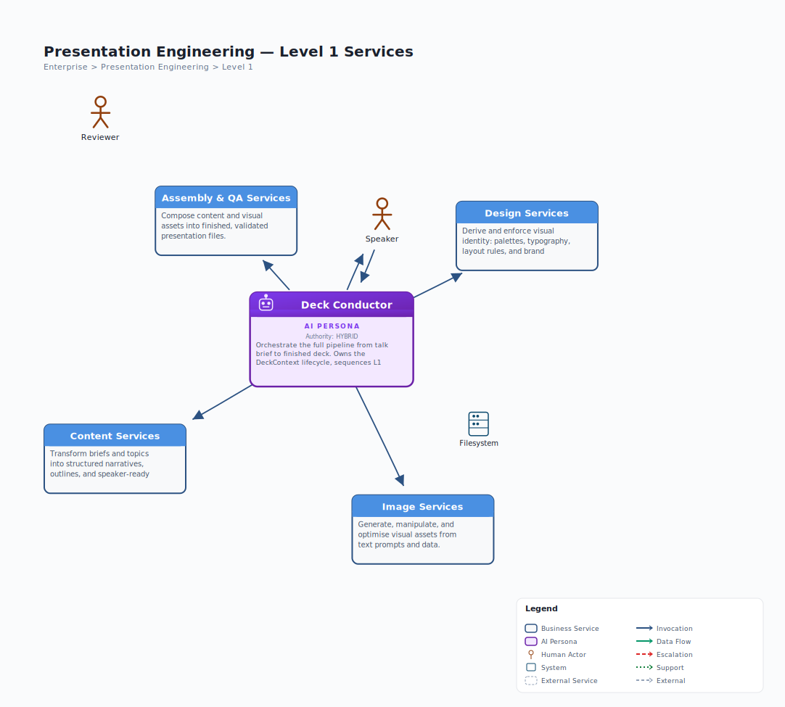
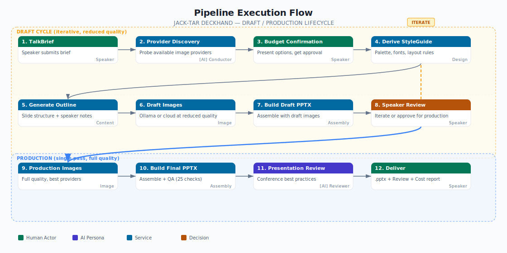

# Architecture Overview -- Jack-Tar Deckhand

> Generated from canonical model: `jack-tar-deckhand.json` v1.0.0
> Date: 2026-03-28
> Status: Draft -- pre-implementation review document

---

## What This System Is

Jack-Tar Deckhand is an AI-First Business Service Architecture for a **Claude Code skill suite** that generates conference-quality PowerPoint presentations. A speaker provides a talk brief (topic, audience, duration, tone) and the system produces a complete `.pptx` file with structured narrative, branded visuals, AI-generated images, data charts, and timed speaker notes.

The system is designed as a set of **independent, reusable service domains** orchestrated by an AI Persona called the Deck Conductor. Each domain is implemented as one or more Claude Code skills that can be invoked independently or as part of the full pipeline.

**Key characteristics:**
- Runs entirely within Claude Code (no external server or database)
- State persisted as JSON files on the local filesystem (`./tmp/deck/`)
- Image generation via local Ollama and/or cloud APIs (OpenAI, Google, FAL.ai, Recraft)
- Graceful degradation when providers are unavailable
- Budget-aware cloud API usage with Speaker approval gates

---

## Service Hierarchy

The architecture follows a three-level hierarchy: L0 (root domain), L1 (service domains), L2 (skills and capabilities).

```
L0  Presentation Engineering
    |
    +-- L1  Deck Conductor  [AI Persona - Orchestrator]
    |
    +-- L1  Design Services
    |   +-- L2  Style Derivation          [skill: slide-stylist]
    |   +-- L2  Brand Extraction          [capability: slide-stylist]
    |   +-- L2  Layout Intelligence       [capability: slide-stylist]
    |
    +-- L1  Content Services
    |   +-- L2  Outline Generation        [skill: narrative-architect]
    |   +-- L2  Speaker Notes             [skill: speaker-notes-writer]
    |
    +-- L1  Image Services
    |   +-- L2  Image Routing & Discovery [skill: imagegen-bridge]
    |   +-- L2  Ollama Image Generation   [skill: ollama-generate-image]
    |   +-- L2  Ollama Icon Generation    [skill: ollama-generate-icon]
    |   +-- L2  Ollama Pattern Generation [skill: ollama-generate-pattern]
    |   +-- L2  Ollama Diagram Generation [skill: ollama-generate-diagram]
    |   +-- L2  Cloud Image Generation    [skill: cloud-generate-image]
    |   +-- L2  Cloud Icon Generation     [skill: cloud-generate-icon]
    |   +-- L2  Chart Rendering           [skill: chart-renderer]
    |   +-- L2  Image Post-Processing     [skill: image-processor]
    |   +-- L2  Image Generation Expert   [AI Persona - Advisory]
    |
    +-- L1  Assembly & QA Services
        +-- L2  PPTX Build               [skill: deck-assembler]
        +-- L2  Visual QA                 [skill: deck-qa]
        +-- L2  File Optimisation         [capability: deck-assembler]
        +-- L2  Presentation Reviewer     [AI Persona - Advisory]
```

**Totals:** 1 L0, 5 L1, 19 L2 (13 skills, 3 capabilities, 3 AI Personas)

### Architecture Diagrams



Drill-down diagrams for each L1 domain:

- [Content Services L2](diagrams/jack-tar-deckhand-content-services-l2.svg)
- [Design Services L2](diagrams/jack-tar-deckhand-design-services-l2.svg)
- [Image Services L2](diagrams/jack-tar-deckhand-image-services-l2.svg)
- [Assembly & QA Services L2](diagrams/jack-tar-deckhand-assembly-qa-services-l2.svg)

---

## The Three AI Personas

### 1. Deck Conductor (L1 -- Orchestrator)

**Authority:** Hybrid (autonomous above 0.8 confidence, escalates to Speaker below)

The top-level orchestration agent. It receives the talk brief, sequences all L1 service invocations, maintains pipeline state, and manages the draft/production lifecycle. During early drafts, it may use Ollama for layout testing; during later drafts, it uses the target cloud provider at reduced quality so prompt refinement happens against the actual model that will produce the final images. When the Speaker approves the draft, it triggers a production render at full quality. It tracks cumulative cost across all cycles, handles the QA correction loop, and never generates content directly -- it always delegates to the appropriate service domain.

### 2. Image Generation Expert (L2 -- Advisory)

**Authority:** Invoker (acts on behalf of the calling skill, escalates to Conductor)

An advisory persona consulted by image generation skills for prompt engineering, model-specific prompt translation, quality scoring against a 6-dimension rubric (composition, colour, clarity, relevance, technical quality, text accuracy), and iteration convergence guidance. It never generates images directly.

### 3. Presentation Reviewer (L2 -- Advisory)

**Authority:** Invoker (acts on behalf of the Conductor, escalates to Conductor)

An advisory persona that reviews assembled decks against conference presentation best practices. It assesses narrative coherence, visual storytelling, pacing, speaker notes quality, and audience appropriateness. It produces structured recommendations but never modifies the deck directly.

---

## Pipeline Execution Flow

The pipeline operates in two phases: **Draft** and **Production**. The Speaker iterates through multiple draft cycles to refine content, layout, narrative, and image prompts before committing to a full-quality production render.

### Draft Phase (iterative)

Each draft cycle runs the full pipeline to produce a reviewable deck. The Speaker iterates on narrative, layout, slide structure, and visual direction across multiple cycles:

- **Design + Content**: Run at full quality (LLM text generation, no cost difference between draft and production)
- **Image**: Uses draft-quality rendering — Ollama for structural placeholders, or cloud providers at reduced size/quality for prompt refinement
- **Assembly + QA + Review**: Build and review the draft deck

The Speaker reviews the draft, gives feedback (adjust narrative, change visual direction, reorder slides, refine prompts), and the Conductor re-runs the affected parts of the pipeline. This cycle repeats until the Speaker approves the draft.

**Important**: Image prompts are model-specific. A prompt tuned for Ollama's flux2-klein will produce very different results on GPT Image 1.5 or Imagen 4. Ollama drafts are useful for testing composition and layout placement, but when the Speaker is refining visual direction for cloud-rendered images, the draft cycle should use the target cloud provider at a reduced quality tier (smaller size, lower resolution) rather than Ollama. The Image Generation Expert persona handles model-specific prompt translation when switching between providers.

### Production Phase (single pass, full quality)

Once the Speaker approves the draft:

1. The Conductor re-renders all images at full quality and full resolution using the approved providers
2. Assembly rebuilds the deck with production images
3. Final QA and Presentation Review run
4. Finished deck is delivered

**The production budget covers full-quality renders only.** Draft cycles with Ollama are free; draft cycles with cloud providers at reduced quality are cheaper but not zero. The Conductor tracks cumulative spend across all cycles.



### Step Dependencies

| Step | Requires | Produces |
|---|---|---|
| Design | TalkBrief, brand assets (optional) | StyleGuide |
| Content | TalkBrief, StyleGuide | SlideOutline, SpeakerNotes |
| Image (draft) | SlideOutline, StyleGuide, AvailableProviders | ImageManifest (low-res) |
| Image (production) | SlideOutline, StyleGuide, AvailableProviders, Speaker approval | ImageManifest (full quality) |
| Assembly | SlideOutline, StyleGuide, ImageManifest, ChartManifest, SpeakerNotes | .pptx |
| QA | .pptx | QAReport |
| Review | .pptx, SlideOutline, StyleGuide, SpeakerNotes, TalkBrief | Structured review |

---

## System Actors and Provider Discovery

The architecture depends on 8 system actors:

| Actor | Type | Purpose | Detection |
|---|---|---|---|
| **Ollama** | Local runtime | Free image generation (z-image-turbo, flux2-klein) | HTTP health check to localhost:11434 |
| **OpenAI API** | Cloud API | GPT Image 1.5 (highest quality) | OPENAI_API_KEY env var |
| **Google Vertex AI** | Cloud API | Imagen 4 (budget workhorse) | GOOGLE_CLOUD_PROJECT env var |
| **FAL.ai** | Cloud aggregator | FLUX.2 Pro, Recraft V4, Ideogram 3.0 | FAL_KEY env var |
| **Recraft API** | Cloud API | Native SVG icon generation | RECRAFT_API_KEY env var |
| **PptxGenJS** | JS library | .pptx file assembly | Always available (npm) |
| **Matplotlib** | Python library | Chart rendering at 300 DPI | Always available (pip) |
| **Filesystem** | Local storage | DeckContext state (./tmp/deck/) | Always available |

### Provider Discovery

At the start of each pipeline run, the `imagegen-bridge` probes all providers and builds an `AvailableProviders` manifest. The Deck Conductor confirms available capabilities with the Speaker before proceeding. The system operates on a "use what's available" principle -- it works with Ollama alone, with cloud APIs alone, or with any combination.

---

## Key Design Principles

### 1. Reusability

L1 service domains (Content, Design, Image, Assembly) are designed as independent, reusable domains. They can be orchestrated by the Deck Conductor for full pipeline runs, or invoked individually for targeted tasks. Each L2 skill reads only the DeckContext files it needs.

### 2. Domain Independence

Each service domain owns its decisions within its scope. The slide-stylist owns design decisions. The narrative-architect owns structural decisions. The imagegen-bridge owns routing decisions. The Deck Conductor orchestrates but does not override domain expertise.

### 3. Graceful Degradation

The system degrades gracefully when providers are unavailable:
- **Cloud preferred model** unavailable: try alternative cloud provider
- **All cloud** unavailable: fall back to local Ollama
- **Ollama** unavailable: use placeholder images (coloured rectangles with alt text)
- **All providers** unavailable: escalate to Speaker

### 4. Budget Awareness

The Deck Conductor tracks cumulative cloud API spend across all cycles — both draft and production. Ollama drafts are free, but cloud provider drafts at reduced quality still cost money. The budget cap declared by the Speaker covers the full session (drafts + production). Cost-optimisation routing prefers Imagen 4 Fast ($0.02/image) for backgrounds and textures, reserving GPT Image 1.5 ($0.133/image) for hero images requiring text accuracy. The Conductor reports running cost to the Speaker at each review point.

### 5. Draft-First Iteration

Decks are built iteratively, not in a single pass. The Conductor manages a draft/production lifecycle where the Speaker refines content, layout, and visual direction across multiple draft cycles before committing to a full-quality production render. Early drafts may use Ollama for layout and composition testing; later drafts use the target cloud provider at reduced quality for prompt refinement (since prompts are model-specific and don't transfer cleanly between providers). The DeckContext tracks which phase the deck is in, cumulative cost, and which slides have been approved.

### 6. Filesystem as State

All shared state is persisted as JSON files in `./tmp/deck/`. This design follows from the constraint that Claude Code skills have no persistent process, no database, and no in-memory state between invocations. Files on disk are the source of truth; conversation context is a convenience cache.

### 7. Correction Loops with Bounds

The QA correction loop is bounded at 2 iterations. After 2 failed QA cycles, the Deck Conductor escalates to the Speaker rather than looping indefinitely. The Presentation Reviewer's feedback goes to the Speaker for decision -- it does not trigger automatic correction.

### 8. Separation of Automated and Human-Judgement QA

The Visual QA (deck-qa) runs 25 automated, machine-checkable anti-pattern checks (contrast, margins, overflow, consistency). The Presentation Reviewer applies human-judgement-level assessment (narrative coherence, visual storytelling, pacing). These are separate steps with different purposes and different feedback paths.

---

## Human Actors

| Actor | Role | Relationship |
|---|---|---|
| **Speaker** | Primary user | Provides TalkBrief, makes creative decisions, approves budget, receives finished deck |
| **Reviewer** | Optional human reviewer | Reviews QAReport and Presentation Review output for content accuracy and brand compliance |

---

## Related Documentation

| Document | Path | Description |
|---|---|---|
| Service Catalogue | [service-catalogue.md](service-catalogue.md) | Full listing of all 25 services with hierarchy |
| AI Persona Summaries | [ai-persona-summaries.md](ai-persona-summaries.md) | Detailed persona specifications |
| Interaction Matrix | [interaction-matrix.md](interaction-matrix.md) | All 27 interactions between entities |
| System Actor Registry | [system-actor-registry.md](system-actor-registry.md) | External systems, configuration, discovery |
| Data Contracts | [data-contracts.md](data-contracts.md) | All 10 data contracts with schemas |
| Canonical Model | [../../.bsa/models/jack-tar-deckhand.json](../../.bsa/models/jack-tar-deckhand.json) | Machine-readable source of truth |
| DeckContext Research | [../../research/12-deckcontext-state-management.md](../../research/12-deckcontext-state-management.md) | Full JSON schemas and state management design |
