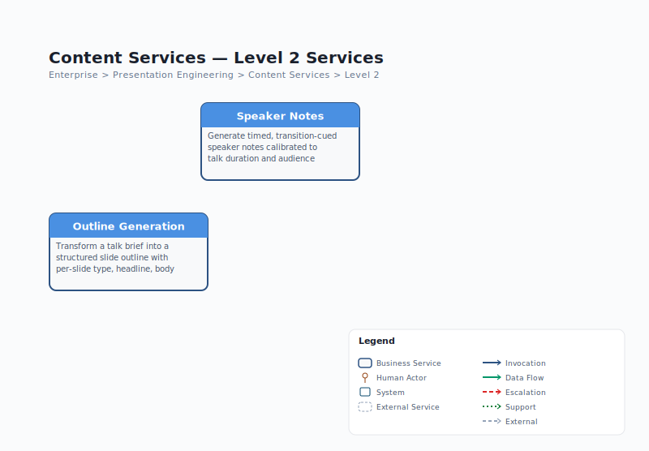

# Content Services -- L1 Service Document

> Generated from canonical model: `jack-tar-deckhand.json` v1.0.0
> Date: 2026-03-29
> Service ID: `content-services`
> Parent: `presentation-engineering` (L0)

---

## Mission

Transform briefs and topics into structured narratives, outlines, and speaker-ready text. Content Services produces the SlideOutline (the backbone of the deck) and SpeakerNotes (timed, transition-cued speaking script), which together define what the deck says and how the speaker delivers it.

---

## Scope

Content Services is the narrative authority for the pipeline. It answers two questions:

1. **What is the story structure?** (Outline Generation)
2. **What does the speaker say?** (Speaker Notes)

The domain receives the TalkBrief and StyleGuide as inputs and produces structured content artefacts that downstream services (Image Services, Assembly) consume. Content Services does not make visual or design decisions -- it works within the design parameters established by Design Services.

---

## L2 Sub-Services

| Service ID | Name | Type | Skill | Description |
|---|---|---|---|---|
| `content-outline-generation` | Outline Generation | Skill | `narrative-architect` | Transform a talk brief into a structured slide outline with per-slide type, headline, body points, narrative beat, and visual direction |
| `content-speaker-notes` | Speaker Notes | Skill | `speaker-notes-writer` | Generate timed, transition-cued speaker notes calibrated to talk duration and audience profile |

### L2 Diagram



---

## Outline Generation (`narrative-architect`)

### Purpose

Transform a TalkBrief into a structured SlideOutline -- an ordered array of slide definitions that forms the complete presentation structure. Each slide definition includes type, headline, body points, narrative beat, visual direction, and layout template reference.

### Key Responsibilities

- Select a narrative arc pattern appropriate to the talk (e.g., situation-complication-resolution, hook-body-callback-cta)
- Determine slide count based on duration and format (5-min lightning talk vs 45-min keynote)
- Assign slide types from the 12 available types (title, section_divider, content, two_column, image_feature, data_chart, stat_callout, quote, icon_grid, diagram, closing, blank_visual)
- Write punchy conference headlines -- not academic paper titles
- Provide visual_direction prose for each slide that Image Services can translate into generation prompts
- Map data sources from the TalkBrief to data_chart slides
- Assign layout templates from the StyleGuide

### Narrative Arc Patterns

The narrative-architect selects from established arc patterns based on talk duration, tone, and content type:

- **situation-complication-resolution** -- standard problem-solving talks
- **hook-body-callback-cta** -- persuasion and call-to-action talks
- **chronological** -- history and progress narratives
- **compare-contrast** -- evaluation and decision-making talks
- **deep-dive** -- technical single-topic explorations

### Constraints

- Maximum 5 body points per slide (projection readability)
- Slide count calibrated to ~1.5-2 minutes per content slide
- Visual direction must be specific enough for prompt engineering but not prescriptive about implementation

---

## Speaker Notes (`speaker-notes-writer`)

### Purpose

Generate per-slide speaker notes with timing markers, cumulative time marks, and interaction cues. Notes are calibrated to the talk duration and target a natural speaking pace.

### Key Responsibilities

- Write specific, actionable notes -- not generic filler ("Explain the three benefits" not "Talk about this slide")
- Calculate timing per slide at target pace (default 130 wpm)
- Insert cumulative timing markers (~5:30, ~8:00) so the speaker can track progress
- Add interaction cues: transitions between slides, pauses for emphasis, audience interaction beats, build animation triggers
- Calibrate total estimated duration to match TalkBrief duration

### Interaction Cue Types

| Cue Type | Purpose | Example |
|---|---|---|
| `transition` | How to move from previous slide | "Building on that data point..." |
| `pause` | Deliberate silence for effect | "[pause 2 seconds for the number to land]" |
| `audience_interaction` | Engage the audience | "Show of hands -- who has experienced this?" |
| `emphasis` | Key point to stress | "This is the number your CFO cares about" |
| `demo` | Live demonstration beat | "Switch to terminal, run the command" |
| `build_animation` | Timed reveal | "Click to reveal the second column" |

---

## Data Contracts

### Consumed

| Contract | Source | Description |
|---|---|---|
| TalkBrief | Speaker (via Deck Conductor) | Topic, audience, duration, tone, key takeaways, data sources, preferences |
| StyleGuide | Design Services (slide-stylist) | Palette, typography, layout templates -- used for layout_template references in the outline |

### Produced

| Contract | File | Consumers | Description |
|---|---|---|---|
| SlideOutline | `./tmp/deck/outline.json` | speaker-notes-writer, imagegen-bridge, deck-assembler, Image Generation Expert, Presentation Reviewer | Ordered slide definitions: type, headline, body points, narrative beat, visual direction, layout template |
| SpeakerNotes | `./tmp/deck/speaker-notes.json` | deck-assembler, Presentation Reviewer | Per-slide timed notes with interaction cues |

---

## Key Interactions

### Inbound

| Source | Type | Data |
|---|---|---|
| Deck Conductor | invocation | TalkBrief, StyleGuide |

### Outbound

| Target | Type | Data |
|---|---|---|
| Image Services | data-provision | SlideOutline (visual_direction field consumed by imagegen-bridge and Image Generation Expert) |
| Assembly & QA Services | data-provision | SlideOutline + SpeakerNotes consumed by deck-assembler and Presentation Reviewer |

### Internal Flow

```
Deck Conductor
  |
  | TalkBrief + StyleGuide
  v
narrative-architect
  |
  | SlideOutline (outline.json)
  v
speaker-notes-writer
  |
  | SpeakerNotes (speaker-notes.json)
  v
Ready for Image Services and Assembly
```

The narrative-architect runs first because the speaker-notes-writer needs the SlideOutline to produce notes. Both outputs are then available for downstream consumption.

---

## Implementation Status

| Component | Skill | Source | Tests | Status |
|---|---|---|---|---|
| Outline Generation | `narrative-architect` | `.claude/skills/narrative-architect/SKILL.md` | -- | Planned (Phase 3) |
| Speaker Notes | `speaker-notes-writer` | `.claude/skills/speaker-notes-writer/SKILL.md` | -- | Planned (Phase 3) |
| SlideOutline schema | -- | `src/schemas/slide_outline.schema.json` | 27 (shared) | Done (Phase 1) |
| SpeakerNotes schema | -- | `src/schemas/speaker_notes.schema.json` | 27 (shared) | Done (Phase 1) |

The JSON schemas for SlideOutline and SpeakerNotes were defined in Phase 1 as part of the 8 contract schemas. The skills themselves (SKILL.md files) are planned for Phase 3.

---

## Related Documentation

| Document | Path |
|---|---|
| Architecture Overview | [architecture-overview.md](architecture-overview.md) |
| Service Catalogue | [service-catalogue.md](service-catalogue.md) |
| Data Contracts | [data-contracts.md](data-contracts.md) |
| Content Services L2 Diagram | [diagrams/jack-tar-deckhand-content-services-l2.svg](diagrams/jack-tar-deckhand-content-services-l2.svg) |
| Research #02 (Narrative Architecture) | [../../research/02-narrative-architecture.md](../../research/02-narrative-architecture.md) |
| Research #03 (Speaker Notes) | [../../research/03-speaker-notes-design.md](../../research/03-speaker-notes-design.md) |
