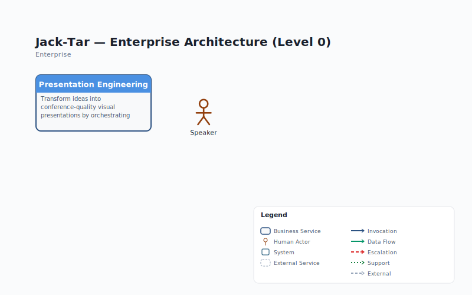

# L0 Enterprise View — Presentation Engineering

> **Source**: `jack-tar-deckhand.json` v1.4.0 | **Level**: L0 | **Date**: 2026-04-03

## Services at L1

| Service | Type | Mission |
|---------|------|---------|
| **Deck Conductor** [AI] | Orchestration Agent | Sequences the full pipeline, manages DeckContext, budget, QA loop |
| **Content Services** | Core Domain | Transform briefs into structured narratives, outlines, speaker text |
| **Design Services** | Core Domain | Derive and enforce visual identity: palettes, typography, layout |
| **Image Services** | Core Domain | Generate, manipulate, and optimise visual assets |
| **Assembly & QA Services** | Core Domain | Compose and validate finished presentation files |

## Actor Interactions

| Actor | Direction | Service | Data |
|-------|-----------|---------|------|
| Speaker | --> | Deck Conductor | TalkBrief, creative decisions, budget approval |
| Deck Conductor | --> | Speaker | .pptx, QAReport, review feedback, cost summary |
| Reviewer | <-- | Assembly & QA | QAReport, Presentation Review output |
