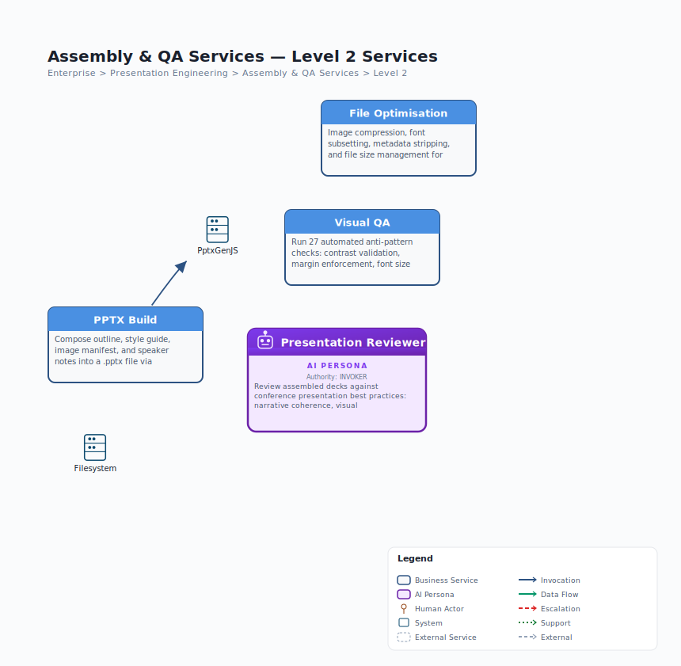

# L1 Assembly & QA Services — Drill-Down

> **Source**: `jack-tar-deckhand.json` | **Level**: L1 > L2 | **Parent**: Presentation Engineering | **Date**: 2026-03-29

## L2 Capabilities

| Capability | Type | Skill | Description |
|------------|------|-------|-------------|
| PPTX Build | Skill | `deck-assembler` | Compose all artefacts into .pptx via PptxGenJS |
| File Optimisation | Capability | within `deck-assembler` | Compression, font subsetting, metadata stripping |
| Visual QA | Skill | `deck-qa` | 30 automated anti-pattern checks |
| Presentation Reviewer | AI Persona | -- | Conference best practices review |

## Data Contract Summary

| Contract | Direction | Description |
|----------|-----------|-------------|
| **SlideOutline** | In | Structured slide plan from Content Services |
| **StyleGuide** | In | Visual identity rules from Design Services |
| **ImageManifest** | In | Generated images with metadata from Image Services |
| **ChartManifest** | In | Generated charts from Image Services |
| **SpeakerNotes** | In | Per-slide speaker notes from Content Services |
| **.pptx file** | Out | Assembled, optimised presentation file |
| **QAReport** | Out | Pass/fail with detailed findings per check |
| **Presentation Review** | Out | Structured per-slide feedback with priority levels |
