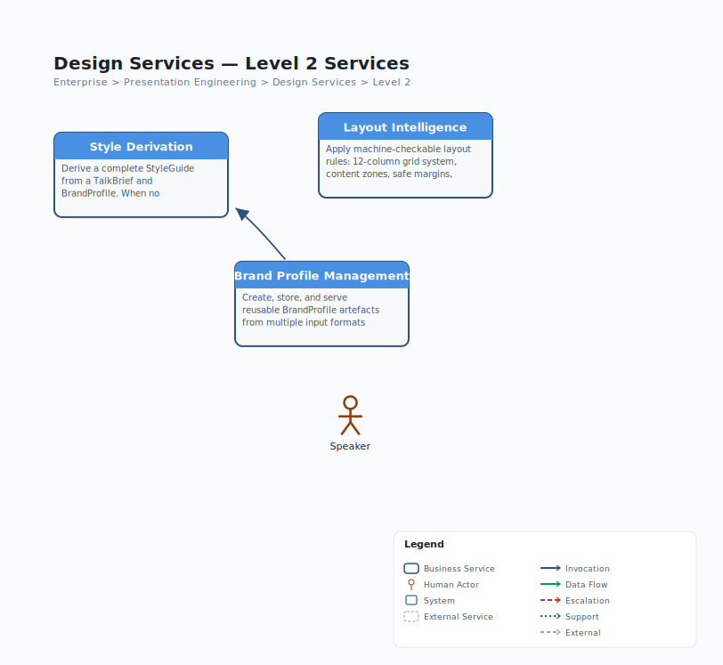

# L1 Design Services — Drill-Down

> **Source**: `jack-tar-deckhand.json` | **Level**: L1 > L2 | **Parent**: Presentation Engineering | **Date**: 2026-03-29

## L2 Capabilities

| Capability | Type | Skill | Description |
|------------|------|-------|-------------|
| Style Derivation | Skill | `slide-stylist` | Derives complete StyleGuide from brief + brand |
| Brand Extraction | Capability | within `slide-stylist` | Extracts palette from logo, maps fonts to tone |
| Layout Intelligence | Capability | within `slide-stylist` | 12-col grid, content zones, safe margins |

## Data Contract Summary

| Contract | Direction | Format | Description |
|----------|-----------|--------|-------------|
| **TalkBrief** | In | JSON | Topic, audience, tone, industry context |
| **Brand Assets** | In (optional) | Files | Logo, brand colours, existing guidelines |
| **StyleGuide** | Out | JSON | Palette, typography, spacing, layout templates, contrast pairs |
