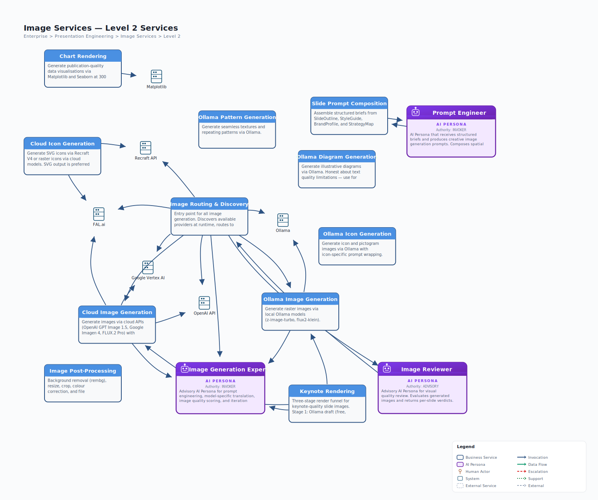

# L1 Image Services — Drill-Down

> **Source**: `jack-tar-deckhand.json` | **Level**: L1 > L2 | **Parent**: Presentation Engineering | **Date**: 2026-03-29

## L2 Capabilities

| Capability | Type | Skill | System Actor |
|------------|------|-------|--------------|
| Image Routing & Discovery | Skill | `imagegen-bridge` | -- (probes all) |
| Ollama Image Generation | Skill | `ollama-generate-image` | Ollama |
| Ollama Icon Generation | Skill | `ollama-generate-icon` | Ollama |
| Ollama Pattern Generation | Skill | `ollama-generate-pattern` | Ollama |
| Ollama Diagram Generation | Skill | `ollama-generate-diagram` | Ollama |
| Cloud Image Generation | Skill | `cloud-generate-image` | OpenAI, Google Vertex AI, FAL.ai |
| Cloud Icon Generation | Skill | `cloud-generate-icon` | Recraft, FAL.ai |
| Chart Rendering | Skill | `chart-renderer` | Matplotlib |
| Image Post-Processing | Skill | `image-processor` | -- |
| Image Generation Expert | AI Persona | -- | -- (advisory only) |

## System Actor Details

| System Actor | Type | Models/Capabilities | Cost |
|-------------|------|---------------------|------|
| **Ollama** | Local runtime | z-image-turbo, flux2-klein | Free (local HW) |
| **OpenAI API** | Cloud API | GPT Image 1.5 | $0.009-$0.133/image |
| **Google Vertex AI** | Cloud API | Imagen 4, Gemini Flash | ~$0.02/image |
| **FAL.ai** | Cloud aggregator | FLUX.2 Pro, Recraft V4, Ideogram 3.0 | Varies |
| **Recraft API** | Cloud API | Recraft V4 (native SVG) | $0.04-$0.30/image |
| **Matplotlib** | Python library | Headless charts, 300 DPI, Agg backend | Free |

## Data Contract Summary

| Contract | Direction | Description |
|----------|-----------|-------------|
| **SlideOutline** (visual_direction) | In | Per-slide visual direction from Content Services |
| **StyleGuide** (palette) | In | Brand palette for colour enforcement |
| **Budget constraints** | In | Per-image and total budget caps from Conductor |
| **ImageManifest** | Out | Generated image files with metadata |
| **ChartManifest** | Out | Generated chart images with metadata |
